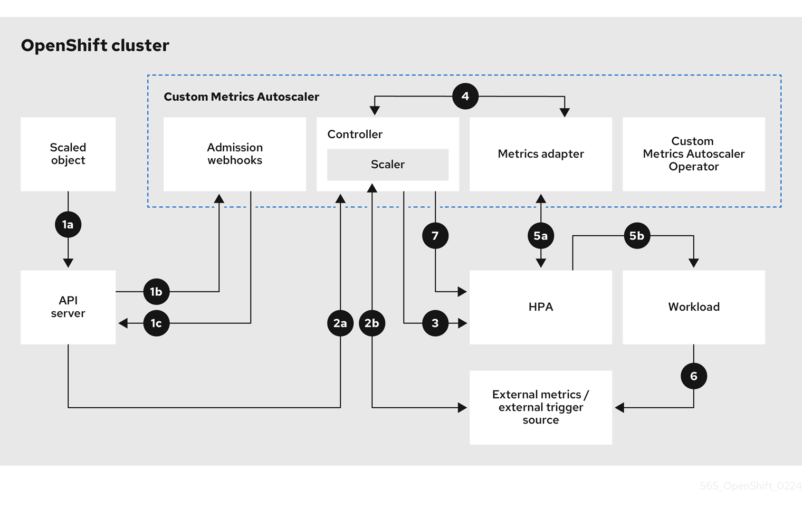

# Demo Custom Metrics Autoscaler Operator

# Guia de despliegue CMAO

## Introducción

EL **CMAO** es un operador opcional basado en el **Kubernetes Event Driven Autoscaler (KEDA)**, que permite escalar nuestras aplicaciones en base a métricas de Prometheus, CPU, Memoria y Apache Kafka.

La documentación oficial está disponible [aquí](https://docs.openshift.com/container-platform/4.14/nodes/cma/nodes-cma-autoscaling-custom.html)


## Tabla de contenido
- [Demo Custom Metrics Autoscaler Operator](#demo-custom-metrics-autoscaler-operator)
  - [Introducción](#introducción)
  - [Tabla de contenido](#tabla-de-contenido)
  - [Arquitectura](#arquitectura)
  - [Instalación del operador](#instalación-del-operador)
  - [Demo](#demo)
  - [---](#---)

## Arquitectura

En el siguiente diagrama podemos ver como se interconectan los componentes.



## Instalación del operador

Para realizar la instalación seguimos la [documentación oficial](https://docs.openshift.com/container-platform/4.14/nodes/cma/nodes-cma-autoscaling-custom-install.html).

Buscamos el operador en el Operator Hub, "Custom Metrics Autoscaler" y lo instalamos con los parámetros por defecto.

Se instala en el namespace **openshift-keda**

A continuación instalamos un **Controllador** "KedaController", nos dirigmos al operador a la sección "KedaController" y lo creamos (Es obligatorio que se llame Keda, de otro modo será ignorado y no se instalará).

Podemos comprobar que está correctamente desplegado:
```
$ oc get deployment -n openshift-keda                                                                                        
NAME                                 READY   UP-TO-DATE   AVAILABLE   AGE
custom-metrics-autoscaler-operator   1/1     1            1           19m
keda-admission                       1/1     1            1           41s
keda-metrics-apiserver               1/1     1            1           41s
keda-operator                        1/1     1            1           41s
```


## Demo

La demo está basada en el ejemplo de (RedHat)[https://www.redhat.com/en/blog/custom-metrics-autoscaler-on-openshift]

Escalaremos una aplicación basado en las peticiones http recibidas, la métrica será recogida por Openshift Monitoring.
Para el caso de un autoescalado en el que se llegara a 0 replicas, habría que abordarlo mediante Knative Serving autoscaler como parte OpenShift Serverless.

- Requisitos
  - Tener instalado el Operador CMA y su controlador
  - Tener habilitada la monitorización de Prometheus para cargas de usuario. [Documentación](https://docs.openshift.com/container-platform/4.14/observability/monitoring/enabling-monitoring-for-user-defined-projects.html)
  
Ahora vamos a desplegar la aplicación de Demo, es una aplicación en GO, que sirve tráfico HTTP y expone las métricas necesarias.

El código original se encuentra en este [github](https://github.com/zroubalik/keda-openshift-examples/tree/main/prometheus/ocp-monitoring)

Nosotros lo personalizamos según los siguientes códigos:

Primero desplegamos el deployment con la aplicación y un servicio de K8s y un Sevice Monitor para exponer las métricas.

**Deployment.yaml** (incluye un servicio y un service monitor)
```
apiVersion: apps/v1
kind: Deployment
metadata:
  labels:
    app: test-app
  name: test-app
  namespace: demo-1
spec:
  replicas: 1
  selector:
    matchLabels:
      app: test-app
  template:
    metadata:
      labels:
        app: test-app
        type: keda-testing
    spec:
      containers:
      - name: prom-test-app
        image: quay.io/zroubalik/prometheus-app:latest
        imagePullPolicy: IfNotPresent
        securityContext:
          allowPrivilegeEscalation: false
          runAsNonRoot: true
          capabilities:
            drop:
              - ALL
          seccompProfile:
            type: RuntimeDefault
---
apiVersion: v1
kind: Service
metadata:
  labels:
    app: test-app
  namespace: demo-1
  annotations:
    prometheus.io/scrape: "true"
  name: test-app
spec:
  ports:
  - name: http
    port: 80
    protocol: TCP
    targetPort: 8080
  selector:
    type: keda-testing
---
apiVersion: monitoring.coreos.com/v1
kind: ServiceMonitor
metadata:
  labels:
  name: keda-testing-sm
  namespace: demo-1
spec:
  endpoints:
  - scheme: http
    port: http
  namespaceSelector: {}
  selector:
    matchLabels:
       app: test-app
```

Para acceder a las métricas, nos conectamos a través del Thanos querier, que requiere autenticación para evitar que cualquiera tenga acceso a las métricas.
Por ello, tenemos que configurar autenticación al operador de CMA para que pueda atacar al thanos.

Creamos un SA "thanos" dentro del namespace de la aplicación.
```
$ oc create serviceaccount thanos -n demo-1
serviceaccount/thanos created
```
comprobamos cual es el token asignado al SA:
```
$ oc describe serviceaccount thanos -n demo-1
Name:                thanos
Namespace:           demo-1
Labels:              <none>
Annotations:         <none>
Image pull secrets:  thanos-dockercfg-ng4v7
Mountable secrets:   thanos-dockercfg-ng4v7
Tokens:              thanos-token-5kw7r         #<------- Este de aquí
Events:              <none>
```

Vamos a utilizar un "TriggerAuthentication" cr para referenciar los credenciales o datos sensibles en el ScaledObject del CMA.

```
apiVersion: keda.sh/v1alpha1
kind: TriggerAuthentication
metadata:
  name: keda-trigger-auth-prometheus
  namespace: demo-1
spec:
  secretTargetRef:
  - parameter: bearerToken
    name: thanos-token-5kw7r
    key: token
  - parameter: ca
    name: thanos-token-5kw7r
    key: ca.crt
```

Ahora vamos a permitir que el SA ataque al thanos, para ello crearemos y asignaremos el siguiente rol:

```
apiVersion: rbac.authorization.k8s.io/v1
kind: Role
metadata:
  name: thanos-metrics-reader
  namespace: demo-1
rules:
- apiGroups:
  - ""
  resources:
  - pods
  verbs:
  - get
- apiGroups:
  - metrics.k8s.io
  resources:
  - pods
  - nodes
  verbs:
  - get
  - list
  - watch
```

`oc adm policy add-role-to-user thanos-metrics-reader -z thanos -n demo-1 --role-namespace=demo-1`
o
```
apiVersion: rbac.authorization.k8s.io/v1
kind: RoleBinding
metadata:
  name: thanos-metrics-reader
  namespace: demo-1
roleRef:
  apiGroup: rbac.authorization.k8s.io
  kind: Role
  name: thanos-metrics-reader
subjects:
- kind: ServiceAccount
  name: thanos
  namespace: demo-1
```

En este punto ya tendríamos la aplicación desplegada, exponiendo métricas, siendo observadas y solo nos faltaría crear la condición de autoescalado.

Para gestionar el autoescalado creamos un objeto "ScaledObject"

```
apiVersion: keda.sh/v1alpha1
kind: ScaledObject
metadata:
  name: prometheus-scaledobject
  namespace: demo-1
spec:
  scaleTargetRef:
    name: test-app
  minReplicaCount: 1
  maxReplicaCount: 10
  pollingInterval: 5
  cooldownPeriod:  10
  triggers:
  - type: prometheus
    metadata:
      serverAddress: https://thanos-querier.openshift-monitoring.svc.cluster.local:9092
      namespace: demo-1
      metricName: http_requests_total
      threshold: '5'
      query: sum(rate(http_requests_total{job="test-app"}[1m]))
      authModes: "bearer"
    authenticationRef:
      name: keda-trigger-auth-prometheus
```

Con el comando: `oc get scaledobject prometheus-scaledobject -o 'jsonpath={..status.conditions[?(@.type=="Ready")].status}' -n demo-1` podemos comprobar que el estado es "Ready"

Con esto tenemos todo listo, podemos ir al prometheus y monitorizar la métrica `http_requests_total{job="test-app"}`

Métrica de http requests:
`sum(rate(http_requests_total{job="test-app"}[1m]))`

Métrica de pods:

`count(kube_running_pod_ready{namespace='demo-1'}) BY (namespace)`

`count(kube_running_pod_ready{namespace='demo-1', pod=~"test-app.*"}) BY (namespace)`

Para generar carga utilizamos la herramienta [hey](https://github.com/rakyll/hey), es una sencilla herramienta para generar carga HTTP.

Podemos lanzar un job con carga temporal
**job.yaml**
```
apiVersion: batch/v1
kind: Job
metadata:
  generateName: generate-requests-
  namespace: demo-1
spec:
  template:
    spec:
      containers:
      - image: quay.io/zroubalik/hey
        name: test
        command: ["/bin/sh"]
        args: ["-c", "for i in $(seq 1 30);do echo $i;/hey -c 5 -n 100 http://test-app.demo-1.svc;sleep 1;done"]
        securityContext:
          allowPrivilegeEscalation: false
          runAsNonRoot: true
          capabilities:
            drop:
              - ALL
          seccompProfile:
            type: RuntimeDefault
      restartPolicy: Never
  activeDeadlineSeconds: 120
  backoffLimit: 2
```

o un cronjob
```
apiVersion: batch/v1
kind: CronJob
metadata:
  name: cron-carga-30m
  namespace: demo-1
spec:
  schedule: '*/30 * * * *'
  paused: false
  jobTemplate:
    spec:
      template:
        spec:
          containers:
          - image: quay.io/zroubalik/hey
            name: test
            command: ["/bin/sh"]
            args: ["-c", "for i in $(seq 1 30); do echo $i; /hey -c 5 -n 100 http://test-app.demo-1.svc; sleep 5; done"]
            securityContext:
              allowPrivilegeEscalation: false
              runAsNonRoot: true
              capabilities:
                drop:
                  - ALL
              seccompProfile:
                type: RuntimeDefault
          restartPolicy: Never
        activeDeadlineSeconds: 120
        backoffLimit: 2
```
```
apiVersion: batch/v1
kind: CronJob
metadata:
  name: cron-carga-60m
  namespace: demo-1
spec:
  schedule: '5 * * * *'
  paused: false
  jobTemplate:
    spec:
      template:
        spec:
          containers:
          - image: quay.io/zroubalik/hey
            name: test
            command: ["/bin/sh"]
            args: ["-c", "for i in $(seq 1 30); do echo $i; /hey -c 5 -n 100 http://test-app.demo-1.svc; sleep 1; done"]
            securityContext:
              allowPrivilegeEscalation: false
              runAsNonRoot: true
              capabilities:
                drop:
                  - ALL
              seccompProfile:
                type: RuntimeDefault
          restartPolicy: Never
        activeDeadlineSeconds: 120
        backoffLimit: 2
```

Para lanzar un job del cronjob `oc create job --from=cronjob/cron-carga-30m job-manual -n demo-1`

o podemos desplegar varios deployment con carga constante en distintos intervalos:
**generador-http-1ps**
```
apiVersion: apps/v1
kind: Deployment
metadata:
  namespace: demo-1
  name: 'generador-http-10ps'
  annotations: {}
spec:
  selector:
    matchLabels:
      app: generador-1ps
  replicas: 1
  template:
    metadata:
      labels:
        app: generador-1ps
    spec:
      containers:
        - name: container-1ps
          command: ["/bin/sh"]
          args: ["-c", "i=0; while true; do echo $i; /hey -c 1 -n 10 http://test-app.demo-1.svc; sleep 1; ((i++)); if ! ((i % 30)); then echo "Durmiendo 1 minutito"; sleep 60; fi; done"]
          image: >-
            quay.io/zroubalik/hey
          ports:
            - containerPort: 8080
              protocol: TCP
          env: []
          securityContext:
            allowPrivilegeEscalation: false
            runAsNonRoot: true
            capabilities:
              drop:
                - ALL
            seccompProfile:
              type: RuntimeDefault
      imagePullSecrets: []
  strategy:
    type: RollingUpdate
    rollingUpdate:
      maxSurge: 25%
      maxUnavailable: 25%
```

```
apiVersion: apps/v1
kind: Deployment
metadata:
  namespace: demo-1
  name: 'generador-http-10p5s'
  annotations: {}
spec:
  selector:
    matchLabels:
      app: generador-10p5s
  replicas: 1
  template:
    metadata:
      labels:
        app: generador-10p5s
    spec:
      containers:
        - name: container-10p5s
          command: ["/bin/sh"]
          args: ["-c", "i=0; while true;do echo $i;/hey -c 1 -n 5 http://test-app.demo-1.svc;sleep 5;i=i+1;done"]
          image: >-
            quay.io/zroubalik/hey
          ports:
            - containerPort: 8080
              protocol: TCP
          env: []
          securityContext:
            allowPrivilegeEscalation: false
            runAsNonRoot: true
            capabilities:
              drop:
                - ALL
            seccompProfile:
              type: RuntimeDefault
      imagePullSecrets: []
  strategy:
    type: RollingUpdate
    rollingUpdate:
      maxSurge: 25%
      maxUnavailable: 25%
```
